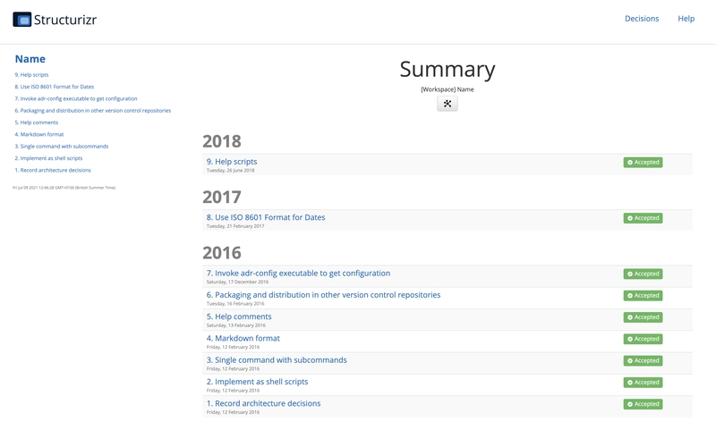
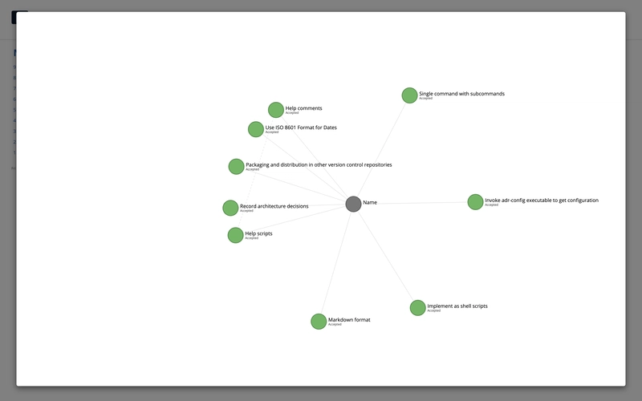

# Visualisation

Based on [Visualising ADRs](https://dev.to/simonbrown/visualising-adrs-3klm)

If you have a folder of ADRs created using Nat's tool, you can get this visualisation for free with [Structurizr Lite](https://structurizr.com/help/lite) in under 5 minutes.


## 1. Create a workspace.dsl file

Create a file named `workspace.dsl` next to your folder of ADRs (here: `docs/architecture/workspace.dsl`).

Add the following content to that file.

```bash
workspace "ADR Workspace" "Architecture Decision Records Management" {
    !adrs decisions
    configuration {
      scope landscape
    }
    model {
        user = person "User" "A user of the management platform."
        softwareSystem = softwareSystem "Software System" "My primary application."
        user -> softwareSystem "Uses" "Web Browser (HTTPS)"
    }
    views {
        systemContext softwareSystem "SystemContext" {
            include *
            autoLayout
        }
        theme default
    }
}
```

This says, "create a workspace, and load the ADRs from the `decisions` sub-directory".

Documentation of `workspace.dsl` is at https://docs.structurizr.com/workspaces/scope

## 2. Start Structurizr Lite

Optional: Stop and remove the current stalled container
```docker
docker rm -f structurizr-local
```

Assuming that you have Docker installed, you can now start Structurizr Lite with the following commands:

```docker
docker run -d --name structurizr-local \
  -p 8080:8080 \
    -e SERVER_PORT=8080 \
      -u "$(id -u):$(id -g)" \
        -v PATH:/usr/local/structurizr \
          structurizr/structurizr local
```

Be sure to replace `PATH` with the full path to the directory containing your `workspace.dsl` file (here: `doc/architecture`). So:

```docker
docker run -d --name structurizr-local \
  -p 8080:8080 \
  -e SERVER_PORT=8080 \
  -u "$(id -u):$(id -g)" \
  -v /workspaces/architecture-decision-records-management/doc/architecture:/usr/local/structurizr \
  structurizr/structurizr local
```

Check the System Container Logs.

Before opening the web view, make sure the system initialized fully without crashing. Run this command:

```bash
docker logs structurizr-local
```

**What you want to see**: The logs should print standard application initialization lines and confirm it is listening for configurations. If you see a file permissions error instead, it means the directory `/doc/architecture` doesn't exist yet or has restricted rights.

## 3. Open Structurizr Lite

Open the workspace in a web browser by heading to http://localhost:8080 and you should see your decisions.



NOTE: If you get the browser to tell you that it cannot open the page, notice The connection refusal happens because you are running the container inside GitHub Codespaces.

When a service runs on port `8080` inside a virtual codespace environment, it cannot be accessed directly via your computer's local network at https://localhost:8080. Instead, GitHub routes it through a secure web proxy URL.

1. The Immediate Fix (Expose the Port)

You do not need to restart your docker container. Since it is already running, open your browser via Codespaces:

1. Look at the bottom tray of your VS Code / Codespaces window and click on the **Ports** tab (next to Terminal).
2. Look for port **8080**.
3. Hover over the **Forwarded Address** column for port 8080 and click the **globe icon** (Open in Browser) or copy the URL.
4. **Important Check**: Make sure the Port Visibility is set to Public or Private (but not blocked) by right-clicking the port row.

------------------------------

## 📝 Running Structurizr Lite inside GitHub Codespaces

### ❌ The Problem

When running the modern structurizr/structurizr Docker container inside GitHub Codespaces, the application serves traffic locally over unencrypted **HTTP**. However, GitHub Codespaces defaults to routing forwarded ports over secure **HTTPS**.

This protocol mismatch causes the GitHub web proxy tunnel to fail behind the scenes, triggering either a `502 Bad Gateway` error, a connection timeout, or a broken redirect back to a physical `localhost` loopback string.

------------------------------

### The Working Solution

1. Launch the Container on an Unrestricted Port

Run the container using an alternative development port (**9090**) and explicitly set the internal application port environment variable:

```docker
docker run -d --name structurizr-local \
  -p 9090:9090 \
  -e PORT=9090 \
  -v /workspaces/architecture-decision-records-management/doc/architecture:/usr/local/structurizr \
  structurizr/structurizr local
```

2. Configure the Network Port in Codespaces
```
   1. Open the Ports tab in the bottom tray of VS Code / Codespaces.
   2. Right-click on the row for port 9090.
   3. Set Port Visibility to Public.
   4. Set Port Protocol to HTTP.
```

3. Access the Web Dashboard
```
   1. In the Ports tab, hover over the Forwarded Address and click the Copy Address icon.
   2. Open a fresh browser tab and paste the address into the URL bar.
   3. Manually modify the beginning of the URL from https:// to http://.
   4. Press Enter and click Continue on the GitHub warning page to open the workspace.
```

------------------------------

Now that your Structurizr environment is fully accessible, would you like to:

* Configure workspace.dsl to auto-parse your adr-tools markdown folder
* Create a shell script to automate this entire Docker setup on codespace startup

---

You can now click through the decisions, and press the Space key to open the quick navigation feature. Click the little graph button underneath the heading, and the visualisation will open.



Over time, the graph will start to change to reflect how decisions have been superseded, deprecated, etc.